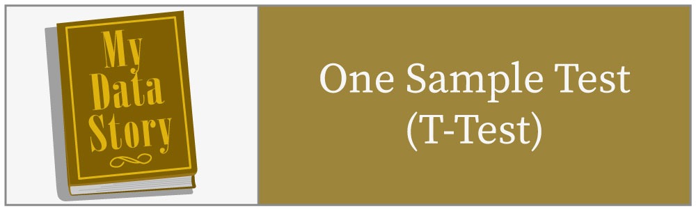
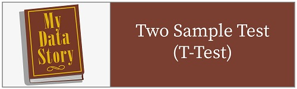
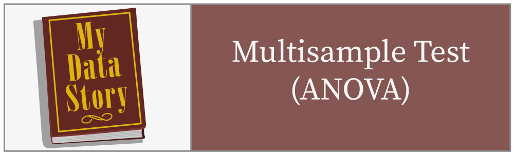
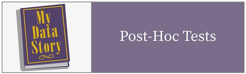
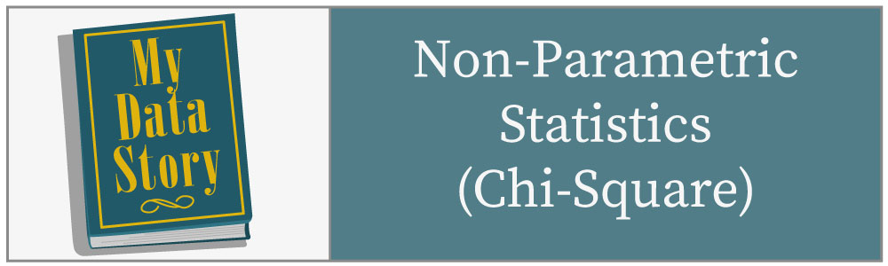
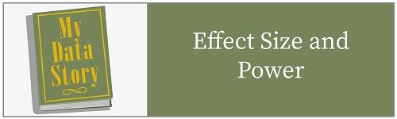
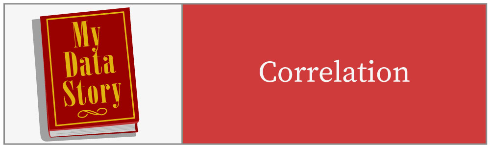

## Introduction to Data Storytelling

1. [Getting Started](http://htmlpreview.github.com/?https://github.com/mydatastory/dsci_class/blob/master/_episodes_html/getting_started.html)
2. [Data Management](http://htmlpreview.github.com/?https://github.com/mydatastory/dsci_class/blob/master/_episodes_html/data_management.html)
3. [Creating Graphs](http://htmlpreview.github.com/?https://github.com/mydatastory/dsci_class/blob/master/_episodes_html/creating_graphs.html)
4. [Central Tendency](http://htmlpreview.github.com/?https://github.com/mydatastory/dsci_class/blob/master/_episodes_html/central_tendency.html)
5. [Dispersion](http://htmlpreview.github.com/?https://github.com/mydatastory/dsci_class/blob/master/_episodes_html/dispersion.html)
6. [Standard Scores](http://htmlpreview.github.com/?https://github.com/mydatastory/dsci_class/blob/master/_episodes_html/standard_scores.html)

