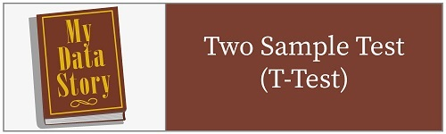

## Introduction to Data Storytelling

1. [Getting Started](http://htmlpreview.github.com/?https://github.com/mydatastory/dsci_class/blob/master/_episodes_html/getting_started.html)
2. [Data Management](http://htmlpreview.github.com/?https://github.com/mydatastory/dsci_class/blob/master/_episodes_html/data_management.html)

